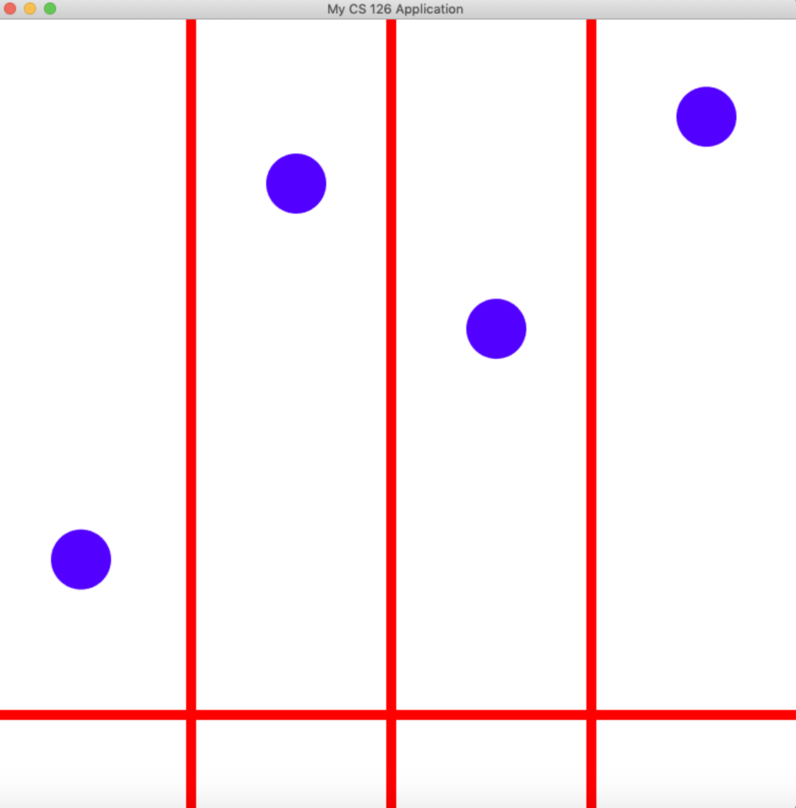

# Rhythm Master
Rhythm Master is inspired by tabbing games such as Guitar Hero and Piano Tiles.
The purpose of the game is to exercise the synchronization between the player's hands
and the brain. Players play by pressing Q, W, O, P keys to prevent tiles from
dropping over the bottom line. If no keys go over, then the player wins. If not, then
The player loses.

## Library Required
Rhythm Master uses the animation and timing library "Choreograph", a library that
makes the animation by updating the position by frames.

The library is one of the Cinder Blocks, it uses Cinder to draw the tiles, stores 
the tile position as 2D vector variables. The library has special methods and functions
that make different animations based on user needs. The library also has methods that
make the repetition of the animations. In this game, the Choreograph library is used
to make the tile animation as well as looping them.

## How to Run the Game
**This game requires the user to download Clion**
- First, clone the repository into whatever folder you want.
- Next, you need to download the Choreograph library, for how to correctly obtain the cinder
block, follow [this link](https://courses.grainger.illinois.edu/cs126/sp2020/notes/cmake/).
- Then find the Cinder 0.9.2 folder, click open.
_ Next, click on "blocks" folder, and click open "choreograph" folder
- Inside the choreograph folder, create a "proj" folder, and inside "proj", create a CMake folder.
- Open Choreograph with Clion, right click on the CMake folder, go to "new" and select 
"CMakeLists.txt".
- Once you made that, follow [this image](resources/CMake.png) to correctly implement the CMake
- To Sync the game with Choreograph, follow the first link.
- And you should be able to run the game!

## Game Controls
Keys and functions:
- S: Go to the selection screen

- 1: Play the game
- Left Arrow: Go Back to the main screen
- ESC: Quit game
- Q: Controls the first column
- W: Controls the second column
- O: Controls the third column
- P: Controls the fourth column

## How to Play the Game
- Once the player starts the game, he /she will see 4 columns and 4 circular tiles dropping down
with different rates of speed.
- The player needs to press either (Q,W,O,P) keys before the tiles reach the end of the screen to
prevent themselves from losing the game.
- If the player successfully clicked on the keys on time, he/she wins the game.